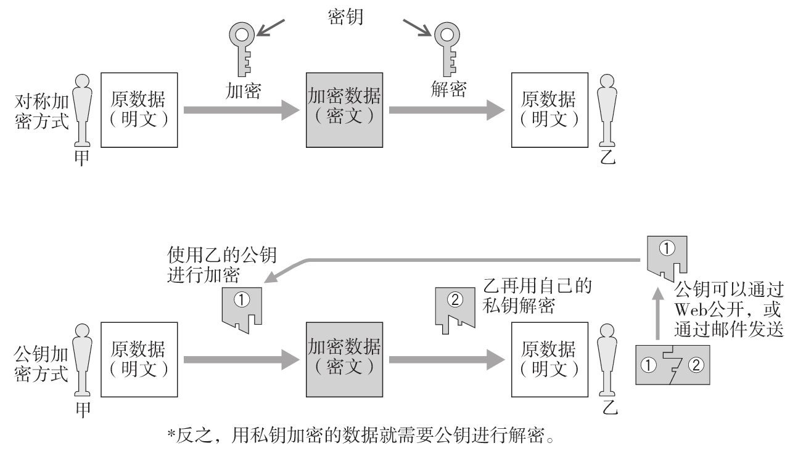
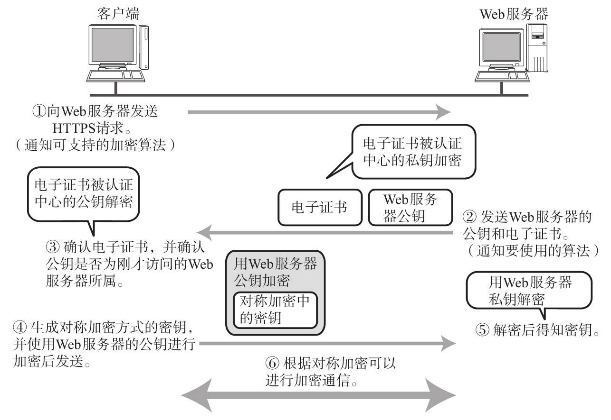

#### 简介

为了防止信息泄漏、实现机密数据的传输，出现了各种各样的加密技术。加密技术分布与OSI参考模型的各个阶层一样，相互协同保证通信。加密技术的逐层分类：

| 分层 | 加密技术 |
| --- | --- |
| 应用层 | SSH、SSL-Telnet |
| 表示层、传输层 | SSL/TLS、SOCKS V5加密 |
| 网络层 | IPsec |
| 数据链路层 | Ethernet、WAN加密装置 |

加密是指利用某个值(密钥)对明文的数据通过一定的算法换成加密(密文)数据的过程。它的逆反过程叫做解密。加密和解密使用相同的密钥叫做**对称加密方式**。反之，如果在加密和解密过程中分别使用不同的密钥(公钥和私钥)则叫做**公钥加密方式**。

Web中可以通过TLS/SSL对HTTP通信进行加密。使用TLS/SSL的HTTP通信叫HTTPS通信。HTTPS采用对称加密方式，在发送公共密钥时采用公钥加密方式。

确认公钥是否正确主要使⽤认证中⼼(CA)签发的证书，⽽主要的认证中⼼的信息已经嵌⼊到浏览器的出⼚设置中。

### 密码学的原则

报文的最初形式为**明文**(plaintext, cleartext)。使用**加密算法**(encryption algorithm)加密明文报文，生成的加密报文称为**密文**(ciphertext)。

### 防火墙